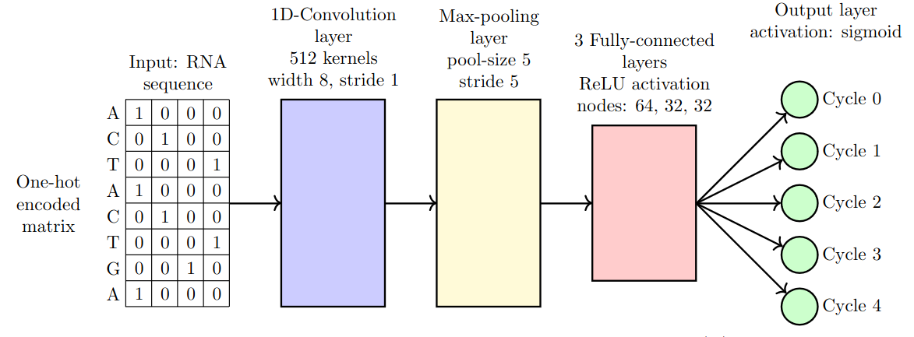
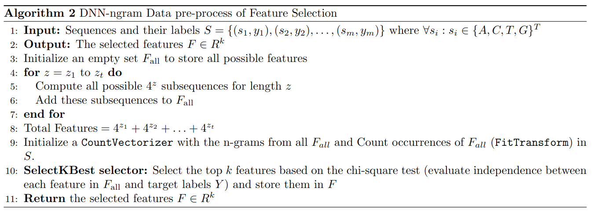
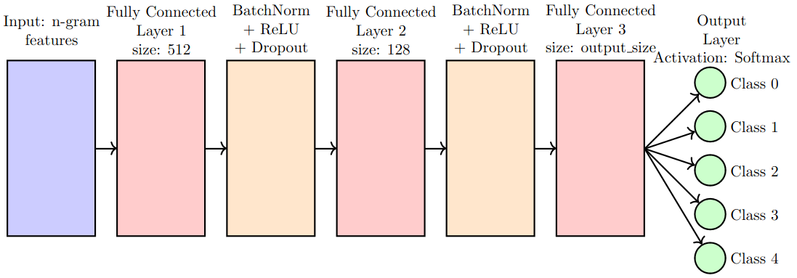
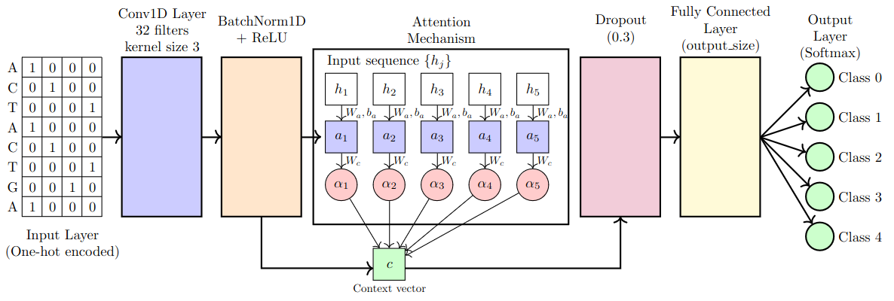
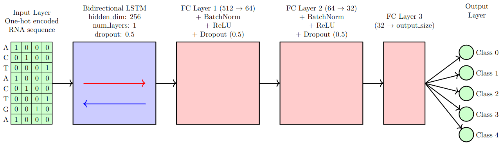
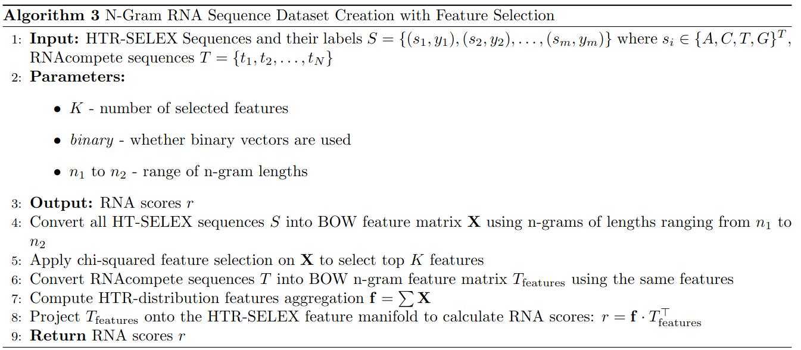

# RNA-binding Project - Deep Learning in Computational Biology

Authors: Haim Zisman and Ori Braverman

## Abstract

In this project, we aim to develop a neural network model to predict RNA-binding intensities for RNA Binding Proteins (RBPs) using high-throughput RNA sequence data. Specifically, given the HTR-SELEX dataset, where each RBP consists of 1-4 files with oligonucleotide sequences, we train a binding model for each RBP. This model is then used to score RNAcompete probes, which are sequences ranging from 30 to 41 nucleotides in length, sorted lexicographically.

The primary challenges are achieving high prediction performance and optimizing the training runtime. The goal is to assign binding intensities to RNAcompete probes and compare the predicted values with the real binding intensities using Pearson correlation. We are provided with 38 development sets (HTR-SELEX data combined with RNAcompete probes and their binding intensities) and 38 evaluation sets (HTR-SELEX data with RNAcompete probes without binding intensities). The model's performance is assessed based on the accuracy of predicted binding intensities and computational efficiency during training.

This work builds on previous models like DeepSELEX, demonstrating the effectiveness of deep neural networks in inferring DNA-binding preferences.

## Baseline Method

The baseline algorithm provides a benchmark to evaluate the effectiveness of our methods in correlating RNAcompete scores with binding intensities for RNA-binding proteins (RBPs).

### Algorithm: Compute Correlations for RNA-Binding Proteins (RBPs)

```python
def compute_correlations(htr_selex_dir, sequences_file, intensities_dir, k_mer_len=7, num_rbps=38):
    correlations = []
    
    for i in range(1, num_rbps + 1):
        # Locate the sequence file paths for the last cycle in htr_selex_dir.
        # Compute k-mer counts for SELEX sequences.
        # Read RNAcompete sequences from sequences_file.
        # Compute RNAcompete scores by dot product between RNAcompete k-mer counts and SELEX k-mer scores.
        # Normalize RNAcompete scores by sequence length.
        # Load binding intensities from intensities_dir.
        # Calculate Pearson correlation between RNAcompete scores and binding intensities.
        # Add the computed correlation to the list.
    
    return correlations
```

## Methodology

### Negative Examples

In this study, three methods were used to sample negative examples:

1. **Random Sampling (RANDOM)**: Generate random sequences of 40 nucleotides, each nucleotide being randomly chosen from {A, C, G, T}.
2. **Sampling from Another Cycle (FROM_CYCLE_1)**: Sample negative examples from sequences found in Cycle 1 files of other RBPs (RBP_j_1.txt where j ≠ i). These sequences are assumed to be less associated with the current RBP, making them suitable as negative examples.
3. **Markov Chain Sampling (MARKOV)**: A Markov chain model, built from Cycle 1 sequences, is used to generate negative examples. The model captures transition probabilities between nucleotides, producing sequences that are statistically similar to Cycle 1 data but distinct enough to serve as negative examples.

We mainly used methods 1 and 2 due to high time computation demand from the last approach.

## Model 1: DeepSELEX

In this experiment, we aimed to replicate the results of the DeepSELEX model on the RNA-binding dataset.


### Prediction Procedure

The prediction procedure begins with an RNA sequence of length (L). During pre-processing, if (L) is less than (k), the sequence is padded, then the sequence divided into subsequences of length (k). For prediction, each subsequence passes through the network, and the results of all the subsequences are aggregated using the formula: `score = max(cycle_4) + max(cycle_3) - min(cycle_0)`. The final output is the aggregated binding score for the RNA sequence.

## Model 2: DNN-ngrams

This model uses N-grams for feature selection and classification. The feature selection phase identifies the most relevant N-gram features for the classification task, and the classification is carried out using a deep neural network.


## Model 3: CNN-Attention

We developed a CNN-Attention model to enhance performance on DNA sequence classification. This model combines the local pattern recognition capabilities of CNNs with the selective focus of attention mechanisms.

## Model 4: LSTM

The LSTM model utilizes bidirectional long short-term memory (LSTM) layers to capture sequence dependencies in the RNA data.



## Model 5: N-gram Selection Projection

This model uses N-gram selection and projection for creating the RNA sequence dataset with feature selection. It was optimized with various k-mer lengths and binary embeddings, resulting in the best performance.

## Normalization of Predicted RNA Scores

The predicted RNA scores can be normalized using the following formula:

```
y = ((x - min_x) / (max_x - min_x)) * (max_y - min_y) + min_y
```

Where:
- `x` is the predicted RNA score from any model,
- `y` is the scaled and biased term (normalized score),
- `min_x` and `max_x` are the minimum and maximum values of the predicted RNA scores,
- `min_y` and `max_y` are the known range of intensities based on known RNA binding proteins (RBPs).

This formula maps the predicted RNA score `x` to a known range of intensities, ensuring that the results fall within a specified range defined by the RBPs.

## Results

Our study evaluated several neural network models for predicting RNA-binding intensities of RNA Binding Proteins (RBPs) using the HTR-SELEX dataset. We compared the performance of different architectures and parameter configurations across 38 RBPs.

| Model              | Average Correlation | Average Time Consumption per RBP |
|--------------------|---------------------|----------------------------------|
| ngram_selection    | 0.2185              | 2 min                            |
| deepselex_k_30     | 0.1424              | 25 min                           |
| deepselex_k_20     | 0.1421              | 25 min                           |
| deepselex_k_14     | 0.1267              | 25 min                           |
| deepselex_k_40     | 0.1226              | 25 min                           |
| dnn                | 0.1204              | 15 min                           |
| cnn_attention      | 0.1195              | 25 min                           |
| lstm               | 0.0798              | 55 min                           |

The N-gram selection model outperformed other architectures, achieving the highest average correlation of 0.2185.

## Code

All deep learning models were trained using a GeForce GTX 3090 GPU. To run the model, navigate to the folder where the `main.py` file is located. Install the required dependencies using:

```bash
pip install -r requirements.txt
```

After installing the dependencies, run the best model using:

```bash
python3 main.py rnacompete rbns_input ... rbns_highest_concentration
```

To run any deep learning model, use:

```bash
python3 train.py rnacompete cycle1 cycle2 .. cyclek --model model_name
```

Ensure the data files `htr-selex/`, `RNAcompete_intensities/`, and `RNAcompete_sequences_rc.txt` are located in the project directory.

## References

- M. Asif and Y. Orenstein, "DeepSELEX: inferring DNA-binding preferences from HT-SELEX data using multi-class CNNs", School of Electrical and Computer Engineering, Ben-Gurion University of the Negev, Beer-Sheva 8410501, Israel.